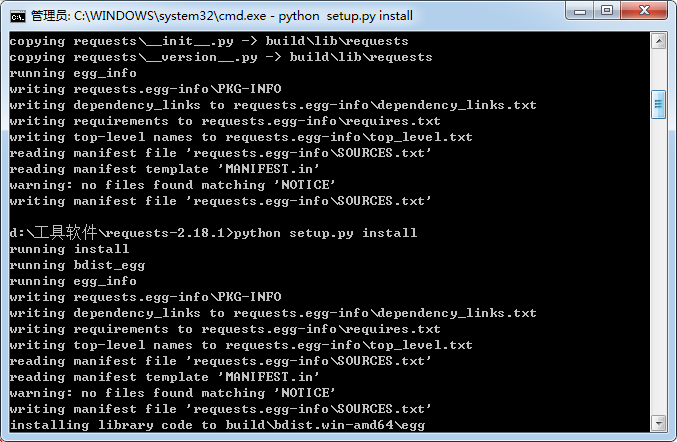

# **README** #

## 想法： ##

最开始是想爬取一些B站相关的东西，但是以现有的能力做不到，所以就选择爬取画师MyRollingStar的图集。

## 参考教程： ##

Python基础教程：http://www.runoob.com/python/python-tutorial.html 

《Python爬虫学习系列教程》：http://www.cnblogs.com/xin-xin/p/4297852.html

## 过程与心得： ##

编写的过程中经常遇到一些问题，比如import urllib.request的时候，说这个包不存在。查阅了相关资料，成功运行的时候还是很有成就感的。

比较匆忙地完成了这次任务，有很多东西学得还不算很精，感觉爬虫是一项很有用的技术，今后无论是否留在实验室都想继续学习，以期爬取自己想要的图片、评论等等。如有错误与不足还请多多包涵。
